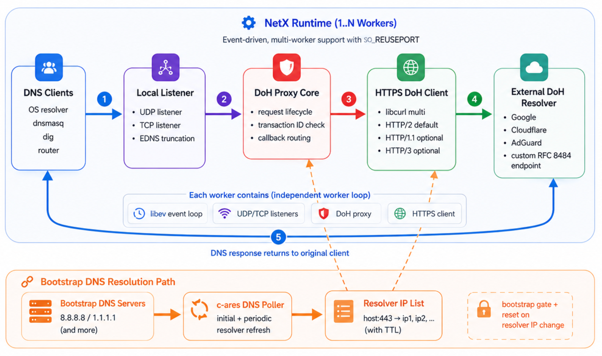
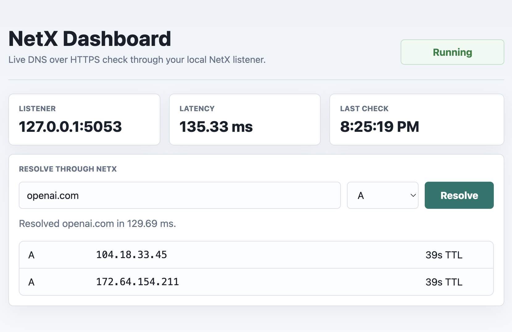

# NetX

**NetX** is a lightweight **DNS over HTTPS (DoH) proxy** written in C. It listens for normal DNS requests over **UDP/TCP** on a local address, forwards them to an upstream **RFC 8484 DoH resolver** over HTTPS, and sends the DNS response back to the original client.

NetX is designed to be small, fast, non caching, and suitable for local machines, routers, and embedded Linux systems.

---

## Preview




---

## Features

- DNS over HTTPS proxy for standard UDP and TCP DNS clients.
- Non-caching design; can sit in front of `dnsmasq` or another caching resolver.
- RFC 8484 wire-format DoH support.
- HTTP/2 by default through libcurl multi.
- Optional HTTP/1.1 mode.
- Optional HTTP/3 / QUIC mode when libcurl supports it.
- Explicit worker threading with independent libev/libcurl loops.
- Bootstrap DNS polling with c-ares.
- Local source address binding for outbound HTTPS/bootstrap DNS.
- EDNS aware UDP truncation support.
- Single process, event driven runtime using libev.
- Logging, statistics, flight recorder, Munin plugin, systemd service, dashboard, Robot Framework tests, sanitizer/fuzzer CI, and benchmark proof artifacts.

---

## Tech Stack

| Category | Technology |
|---|---|
| Core Language | C |
| Build System | CMake |
| Networking | UDP, TCP, DNS Sockets |
| DoH Client | libcurl |
| Event Loop | libev |
| DNS Resolution | c-ares |
| Protocols | DNS, DNS over HTTPS, HTTP/2, HTTP/3 |
| Dashboard | Python, HTML, CSS, JavaScript |
| Service Management | systemd |
| Monitoring | Munin, Custom Logging |
| Testing | Robot Framework, Valgrind |
| Hardening | ASan, UBSan, libFuzzer |
| DevOps | Docker, GitHub Actions |

---

## Project Structure

```text
NetX/
├── .github/
│   └── workflows/
│       └── cmake.yml
├── dashboard/
│   ├── index.html
│   └── server.py
├── benchmarks/
│   └── benchmark_ring_buffer.c
├── images/
│   ├── preview-1.png
│   └── preview-2.png
├── munin/
│   ├── NetX.config
│   └── NetX.plugin
├── src/
│   ├── dns_common.h
│   ├── dns_listener.h
│   ├── dns_listener_tcp.c
│   ├── dns_listener_tcp.h
│   ├── dns_listener_udp.c
│   ├── dns_listener_udp.h
│   ├── dns_poller.c
│   ├── dns_poller.h
│   ├── dns_truncate.c
│   ├── dns_truncate.h
│   ├── doh_proxy.c
│   ├── doh_proxy.h
│   ├── https_client.c
│   ├── https_client.h
│   ├── logging.c
│   ├── logging.h
│   ├── main.c
│   ├── options.c
│   ├── options.h
│   ├── ring_buffer.c
│   ├── ring_buffer.h
│   ├── stat.c
│   └── stat.h
├── tests/
│   ├── docker/
│   │   ├── Dockerfile
│   │   └── run_all_tests.sh
│   ├── fuzz/
│   │   ├── fuzz_dns_truncate.c
│   │   └── fuzz_ring_buffer.c
│   └── robot/
│       ├── DnsTcpClient.py
│       ├── functional_tests.robot
│       └── valgrind.supp
├── tools/
│   └── benchmark_proof.sh
├── .gitignore
├── CMakeLists.txt
├── LICENSE
├── NetX.service.in
├── README.md
└── development_build_with_http3.sh
```

---

## Requirements

NetX depends on:

- C compiler
- CMake 3.10+
- c-ares 1.11.0+
- libcurl 7.66.0+
- libev 4.25+
- Optional: libsystemd development package

### Ubuntu / Debian

```bash
sudo apt-get update
sudo apt-get install -y \
  cmake \
  build-essential \
  libc-ares-dev \
  libcurl4-openssl-dev \
  libev-dev \
  libsystemd-dev
```

### Fedora / RHEL-based systems

```bash
sudo dnf install -y \
  cmake \
  gcc \
  make \
  c-ares-devel \
  libcurl-devel \
  libev-devel \
  systemd-devel
```

### macOS

```bash
brew install cmake c-ares curl libev
```

If CMake cannot find Homebrew curl headers, make sure Homebrew paths are available in your shell environment.

---

## Build

From the project root:

```bash
cmake -S . -B build
cmake --build build
```

The binary will be created at:

```text
build/NetX
```

Run version check:

```bash
./build/NetX -V
```

Show help:

```bash
./build/NetX -h
```

---

## Quick Start

### Run with default Google DoH resolver

```bash
./build/NetX -a 127.0.0.1 -p 5053 -r https://dns.google/dns-query -v -v
```

Run with four worker threads:

```bash
./build/NetX -a 127.0.0.1 -p 5053 -W 4 -r https://dns.google/dns-query
```

Test with `dig`:

```bash
dig @127.0.0.1 -p 5053 openai.com
```

### Use Cloudflare DoH

```bash
./build/NetX \
  -a 127.0.0.1 \
  -p 5053 \
  -b 1.1.1.1,1.0.0.1 \
  -r https://cloudflare-dns.com/dns-query \
  -v -v
```

### Use AdGuard DoH

```bash
./build/NetX \
  -a 127.0.0.1 \
  -p 5053 \
  -b 94.140.14.14,94.140.15.15 \
  -r https://dns.adguard.com/dns-query \
  -v -v
```

---

## Common Usage

### Run as a daemon

```bash
sudo ./build/NetX \
  -u nobody \
  -g nogroup \
  -d \
  -b 8.8.8.8,8.8.4.4 \
  -r https://dns.google/dns-query
```

### Bind to all local interfaces

```bash
./build/NetX -a 0.0.0.0 -p 5053
```

### Force IPv4 resolver addresses

```bash
./build/NetX -4
```

### Use HTTP/1.1 instead of HTTP/2

```bash
./build/NetX -x
```

### Use HTTP/3 / QUIC only

```bash
./build/NetX -q
```

This requires a libcurl build with HTTP/3 support.

### Explicit worker threads

Use `-W <workers>` to run multiple independent listener workers in one process.
Each worker owns its own libev loop, libcurl multi handle, DNS poller, UDP socket,
and TCP listener. On platforms with `SO_REUSEPORT`, the kernel distributes UDP
datagrams and TCP accepts across workers.

```bash
./build/NetX -W 4 -T 100
```

The default is `-W 1`.

---

## Hardening

### Sanitizers

```bash
cmake -S . -B build-sanitize \
  -D CMAKE_BUILD_TYPE=Debug \
  -D NETX_ENABLE_SANITIZERS=ON \
  -D USE_CLANG_TIDY=OFF
cmake --build build-sanitize
ctest --test-dir build-sanitize --output-on-failure
```

### Fuzzing

Fuzz targets require Clang because they use libFuzzer.

```bash
CC=clang cmake -S . -B build-fuzz \
  -D CMAKE_BUILD_TYPE=Debug \
  -D NETX_ENABLE_SANITIZERS=ON \
  -D NETX_BUILD_FUZZERS=ON \
  -D USE_CLANG_TIDY=OFF
cmake --build build-fuzz
ctest --test-dir build-fuzz --output-on-failure
```

### Benchmark proof

```bash
./tools/benchmark_proof.sh
cat build/benchmarks/netx_benchmark_proof.json
```

The GitHub Actions workflow also uploads `netx_benchmark_proof.json` as the
`netx-benchmark-proof` artifact.

### Use an HTTP/SOCKS proxy

```bash
./build/NetX -t socks5h://127.0.0.1:1080
```

### Print statistics every 300 seconds

```bash
./build/NetX -s 300
```

### Increase logging verbosity

```bash
./build/NetX -v -v -v
```

---

## Important Options

| Option | Description |
|---|---|
| `-a <listen_addr>` | Local address to bind. Default: `127.0.0.1` |
| `-p <listen_port>` | Local DNS listener port. Default: `5053` |
| `-T <limit>` | TCP client limit. Default: `20` |
| `-b <dns_servers>` | Bootstrap DNS servers for resolving the DoH hostname |
| `-i <seconds>` | Bootstrap DNS polling interval. Default: `120` |
| `-4` | Force IPv4 resolver hostnames |
| `-r <resolver_url>` | DoH resolver URL. Default: `https://dns.google/dns-query` |
| `-t <proxy_server>` | Optional HTTP/SOCKS proxy |
| `-S <source_addr>` | Source address for outbound HTTPS and bootstrap DNS |
| `-x` | Use HTTP/1.1 instead of HTTP/2 |
| `-q` | Use HTTP/3 / QUIC only |
| `-m <seconds>` | Maximum HTTPS connection idle reuse time |
| `-L <seconds>` | Tolerated connection-loss time for reused connections |
| `-C <ca_path>` | Custom CA certificate path |
| `-c <dscp>` | DSCP codepoint for upstream HTTPS sockets |
| `-d` | Daemonize |
| `-u <user>` | Drop privileges to user |
| `-g <group>` | Drop privileges to group |
| `-l <logfile>` | Log file path. Default: stdout |
| `-s <seconds>` | Statistics print interval |
| `-F <count>` | Flight recorder buffer size |
| `-V` | Print version and exit |
| `-h` | Print help and exit |

---

## Install

After building:

```bash
sudo cmake --install build
```

This installs:

- NetX binary
- systemd service file
- Munin plugin if Munin directories exist

Enable and start the service:

```bash
sudo systemctl daemon-reload
sudo systemctl enable NetX
sudo systemctl start NetX
sudo systemctl status NetX
```

Override service options:

```bash
sudo systemctl edit NetX.service
```

Example override:

```ini
[Service]
ExecStart=
ExecStart=/usr/local/bin/NetX -v -v -r https://cloudflare-dns.com/dns-query
```

Restart after changes:

```bash
sudo systemctl daemon-reload
sudo systemctl restart NetX
```

---

## Docker

Example Docker run using AdGuard DNS:

```bash
docker run --name NetX -p 5053:5053/udp \
  -e DNS_SERVERS="94.140.14.14,94.140.15.15" \
  -e RESOLVER_URL="https://dns.adguard.com/dns-query" \
  -d alokpriyadarshii/netx \
  -4 -vvv
```

Then test:

```bash
dig @127.0.0.1 -p 5053 openai.com
```

---

## Testing

Install Robot Framework:

```bash
pip3 install robotframework
```

Run functional tests:

```bash
python3 -m robot.run tests/robot/functional_tests.robot
```

Docker-based tests:

```bash
tests/docker/run_all_tests.sh
```

The test suite covers UDP, TCP, HTTP behavior, truncation behavior, source address binding, and Valgrind checks.

---

## Troubleshooting

### Port already in use

If port `5053` is busy, run NetX on another port:

```bash
./build/NetX -p 55353
```

Test with:

```bash
dig @127.0.0.1 -p 55353 openai.com
```

### No response from resolver

Try increasing logs:

```bash
./build/NetX -v -v -v
```

Also verify network access to the DoH endpoint and bootstrap DNS servers.

### Cloudflare / Google hostname resolution problem

Use bootstrap DNS servers explicitly:

```bash
./build/NetX -b 8.8.8.8,1.1.1.1
```

### HTTP/2 problems with libcurl

Fallback to HTTP/1.1:

```bash
./build/NetX -x
```
